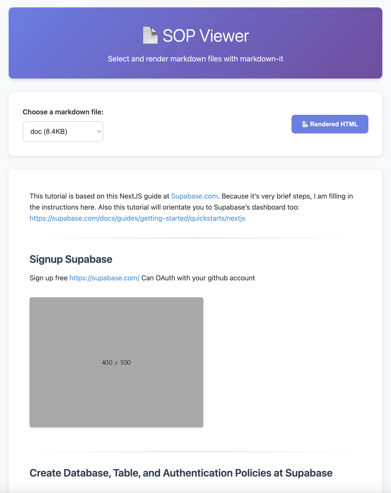

# Markdown Mindmap Viewer

By Weng (Weng Fei Fung)


<a target="_blank" href="https://github.com/Siphon880gh" rel="nofollow"></a>
<a target="_blank" href="https://www.linkedin.com/in/weng-fung/" rel="nofollow"></a>
<a target="_blank" href="https://www.youtube.com/@WayneTeachesCode/" rel="nofollow"></a>

## Summary

An SOP reader for Markdown documents that not only creates a table of contents, but also generates mind maps and displays custom link popovers with user-selected excerpts.

- 📄 **Auto-Discovery**: Automatically scans and loads `.md` files from `documents/` folder with instant dropdown access
- 🧠 **Smart Mindmaps**: Generates interactive Mermaid.js mindmaps from markdown lists using `1x1.png` image markers with multiple layout types (spider, tree-down, tree-right)
- 🔗 **Link Previews**: Hover-based content previews that extract webpage text between boundary words using `1x2.png` markers (A..B or A...B patterns)
- 🎯 **Dual-Mode Viewing**: Toggle between rendered HTML and raw markdown with synchronized table of contents navigation
- ⚡ **Performance Optimized**: Features prerendering, caching, and instant loading with smooth animations
- 🎨 **Modern UI**: Responsive design with gradient styling, full-screen modes, zoom controls, and drag functionality
- 🔧 **Developer-Friendly**: Built with vanilla HTML/CSS/JavaScript, configurable via JSON, and includes file watching for development

*For detailed technical context and AI-friendly documentation, see [`context.md`](context.md) and feature-specific context files (`context-*.md`)*

---

## Features



### 📄 Document Management
- **Dynamic File Discovery**: Automatically scans the `documents/` folder for markdown files with metadata extraction
- **Build System**: Uses npm scripts to generate file listings with file sizes and modification dates
- **File Watching**: Development mode with automatic rebuilds when files change
- **Zero Configuration**: Works out of the box - just add your `.md` files to the `documents/` folder

### 🎨 Viewing & Navigation
- **Dual-Mode Viewing**: Seamlessly toggle between beautifully rendered HTML and raw markdown source
- **Interactive Table of Contents**: Floating TOC panel with smooth scroll navigation that works in both viewing modes
- **Responsive Design**: Modern gradient UI that adapts to desktop and mobile devices
- **Fast Rendering**: Powered by markdown-it with full CommonMark support and syntax highlighting

### 🧠 Smart Mindmap Generation
Transform your markdown lists into interactive visual mindmaps using a simple image marker system:

- **Marker System**: Add `` after any list item or heading to include it in the mindmap
- **Multiple Layout Types**:
  - **Spider** (default): Radial mindmap with central root node
  - **Tree Down**: Hierarchical top-down tree structure
  - **Tree Right**: Hierarchical left-to-right tree structure
- **Interactive Controls**:
  - Zoom in/out with mouse wheel or control buttons
  - Drag to pan around large mindmaps
  - Full-screen mode for detailed viewing
  - Layout type cycling with live preview
- **Visual Enhancements**:
  - Golden-angle color palette for branch differentiation
  - Automatic text styling and contrast optimization
  - Smooth animations and transitions
- **Performance**: Prerendering for instant display when mindmap content is detected

**Example Mindmap Syntax:**
```markdown
## Project Structure 

- Frontend Development 
  - UI Components 
  - State Management 
- Backend Development 
  - API Design 
  - Database 
```

### 🔗 Link Popover Previews
Enhance your documentation with hover-based content previews from external websites:

- **Marker System**: Add `` after any link to enable popover preview
- **Boundary Word Extraction**: Extracts text between specified start and end words from the linked webpage
- **CORS Proxy**: Uses `api.allorigins.win` to fetch content from external sites
- **Smart Positioning**: Popovers automatically position to stay within viewport
- **Caching**: Intelligent caching system prevents redundant requests
- **Error Handling**: Graceful fallbacks when content extraction fails

**Example Popover Syntax:**
```markdown
Check out [MDN Web Docs](https://developer.mozilla.org) 

Visit [GitHub](https://github.com) 
```

### ⚙️ Configuration & Development
- **JSON Configuration**: Customize mindmap types and other settings via `config.json`
- **Hot Reloading**: File watcher automatically rebuilds when documents change
- **Static Hosting Compatible**: Works with any static hosting service (GitHub Pages, Netlify, etc.)
- **Build Scripts**: Comprehensive npm scripts for development and production workflows

## Quick Start

1. **Install dependencies**:
   ```bash
   npm install
   ```

2. **Add your markdown files** to the `documents/` folder

3. **Build the file list**:
   ```bash
   npm run build
   ```

4. **Start the development server**:
   ```bash
   npm run dev
   ```

5. **Open your browser** to `http://127.0.0.1:8000`

## Configuration

The application supports configuration through a `config.json` file in the root directory:

```json
{
  "mindmap": {
    "type": "spider"
  }
}
```

### Mindmap Types

- **Spider (default)**: Radial mindmap with central root node. Set the type to `spider`.
- **Tree**: Hierarchical tree layout with top-down structure. Set the type to `tree` or `tree-down`.
- **Tree-right**: Hierarchical tree layout with left-to-right structure. Set the type to `tree-right`.

To change the mindmap type, simply update the `type` field in `config.json` and refresh the page.

## Available Scripts

- `npm run build` - Generate `markdownFiles.json` from files in `documents/`
- `npm run dev` - Build and start development server
- `npm run serve` - Start server without building
- `npm run watch` - Watch `documents/` folder and auto-rebuild on changes

## Project Structure

```
mdmindmap/
├── assets/                    # Frontend assets
│   ├── script.js             # Main application logic
│   ├── mindmap.js            # Mindmap generation and interaction
│   ├── popover.js            # Link popover functionality
│   ├── style.css             # Main styling
│   ├── mindmap.css           # Mindmap-specific styles
│   └── popover.css           # Popover-specific styles
├── documents/                 # Place your .md files here
│   ├── img/                  # Image assets for mindmaps
│   │   └── 1x1.png          # Mindmap marker images
│   ├── 1x2.png              # Popover marker images
│   ├── doc.md               # Sample documentation
│   ├── sample.md            # Basic sample file
│   ├── mindmap-test.md      # Mindmap examples
│   └── popover-test.md      # Popover examples
├── scripts/
│   ├── generateFileList.js  # Build script for file discovery
│   └── watch.js             # Development file watcher
├── config.json              # Configuration (mindmap types, etc.)
├── index.html               # Main HTML structure
├── markdownFiles.json       # Generated file list (auto-generated)
├── package.json             # Dependencies and build scripts
└── context*.md              # Technical documentation files
```

## Development Workflow

1. **Add new markdown files** to `documents/` folder
2. **Run `npm run build`** to update the file list
3. **Refresh your browser** to see the new files in the dropdown

For continuous development, use `npm run watch` to automatically rebuild when files change.

## Marker Image System

The application uses a simple image marker system to enable advanced features:

### Mindmap Markers (`1x1.png`)
- Place `` after headings or list items to include them in mindmaps
- The alt text becomes the node label in the mindmap
- Supports nested hierarchies following your markdown structure
- Works with both headings and bulleted lists

### Popover Markers (`1x2.png`)  
- Place `` after any link to enable hover previews
- Use `..` (two dots) or `...` (three dots) to separate boundary words
- The system extracts text between these words from the linked webpage
- Marker images are automatically hidden in the rendered output

**Note**: The actual image files don't need to exist - they serve as semantic markers for the JavaScript to detect and process.

## How It Works

1. The build script (`scripts/generateFileList.js`) scans the `documents/` folder
2. It generates `markdownFiles.json` with metadata about each markdown file
3. The HTML page fetches this JSON and populates the dropdown dynamically
4. When you select a file, it's loaded from the `documents/` folder and rendered

This approach eliminates the need to hardcode file lists while maintaining compatibility with static hosting.
